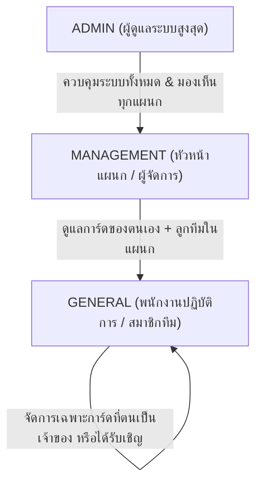
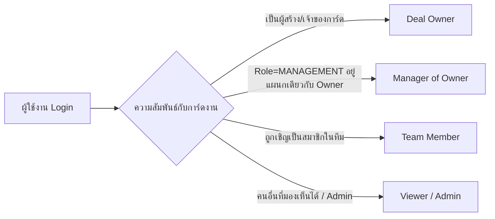

# 01. บทบาทผู้ใช้และโครงสร้างแผนก (User Roles & Departments)

> **กลุ่มเป้าหมายผู้อ่าน**: พนักงานทุกระดับ, ผู้ดูแลระบบ (Admin) และ AI Agent  
> **วัตถุประสงค์**: อธิบายโครงสร้างสิทธิ์ (Role), ระบบแผนก (Department) และความสัมพันธ์เชิงสิทธิ์ในการเข้าถึงและจัดการการ์ดงาน (Deal Relationship & Ownership)

---

## 1. บทบาทผู้ใช้หลัก (System User Roles)

ระบบ CRM มีการแบ่งระดับผู้ใช้งานตาม `Role` ในระดับฐานข้อมูลออกเป็น 3 ระดับหลัก:

### ตารางเปรียบเทียบสิทธิ์ตาม Role

| สิทธิ์ / ฟังก์ชันการใช้งาน | `ADMIN` | `MANAGEMENT` | `GENERAL` |
| :--- | :---: | :---: | :---: |
| **การมองเห็นการ์ดบน Pipeline** | มองเห็นทุกการ์ด ทุกแผนก | มองเห็นการ์ดของตนเอง + การ์ดของทุกคนในแผนกเดียวกัน | มองเห็นเฉพาะการ์ดที่ตนเป็น Owner หรือเป็น Team Member |
| **สร้างการ์ดงานใหม่** | ✅ ได้ทุกประเภท | ✅ ได้ทุกประเภท | ✅ ได้ทุกประเภท |
| **แก้ไขข้อมูลการ์ดของตนเอง** | ✅ ได้ | ✅ ได้ | ✅ ได้ |
| **แก้ไขการ์ดของสมาชิกคนอื่นในแผนก** | ✅ ได้ | ✅ ได้ (เป็น Manager) | ❌ ไม่ได้ (ต้องเป็น Member) |
| **ส่งคำถามเร่งด่วน (Manager Call / Accelerator)** | ✅ ได้ | ✅ ได้ (เฉพาะการ์ดของลูกทีม) | ❌ ไม่มีสิทธิ์สร้าง |
| **การปิดดีล (Close as Won / Lost)** | ✅ ปิดได้ทุกการ์ด | ✅ ปิดการ์ดของตนเอง + ของลูกทีมในแผนกได้ | ✅ ปิดได้เฉพาะการ์ดที่ตนเป็น Owner |
| **การแปลงประเภทเป็น Sales Deal** | ✅ ได้ทุกการ์ด | ✅ การ์ดตนเอง + ลูกทีมในแผนก (หากแผนกมีสิทธิ์) | ✅ เฉพาะการ์ดตนเอง (หากแผนกมีสิทธิ์) |
| **การลบการ์ดถาวร (Permanent Delete)** | ✅ ลบได้ทุกการ์ด | ❌ ลบได้เฉพาะการ์ดที่ตนเป็น Owner | ❌ ลบได้เฉพาะการ์ดที่ตนเป็น Owner |
| **เข้าถึงหน้า System Settings & สิทธิ์เมนู** | ✅ ได้เต็มรูปแบบ | ❌ ไม่มีสิทธิ์เข้าถึง | ❌ ไม่มีสิทธิ์เข้าถึง |

---

## 2. โครงสร้างแผนก (Departments) และการผูกสิทธิ์

ระบบใช้รูปแบบ **Many-to-Many Relationship** ระหว่าง `User` และ `Department`:
- พนักงาน 1 คน สามารถสังกัดได้ **มากกว่า 1 แผนก** (เช่น อยู่ทั้ง Sales และ Key Account)
- สิทธิ์การเข้าถึงเมนูและฟีเจอร์ต่างๆ จะคำนวณจาก **ผลรวม (Union)** ของสิทธิ์ที่ทุกแผนกของพนักงานคนนั้นได้รับ
- หากพนักงานคนใดไม่มีแผนกสังกัด และไม่ใช่ `ADMIN` ระบบจะไม่อนุญาตให้เข้าใช้งานพื้นที่การทำงานหลัก

### ความสำคัญของแผนกต่อการมองเห็นข้อมูล
1. **ขอบเขตการเข้าถึงข้อมูล (Data Scoping)**:
   - ผู้ใช้ระดับ `MANAGEMENT` จะมองเห็นการ์ดทั้งหมดที่สร้างโดยผู้ใช้ที่อยู่ในแผนกเดียวกันกับตน
   - การแจ้งเตือนคำขอโอนการ์ดหรือกิจกรรม จะสามารถส่งต่อภายในกลุ่มสมาชิกแผนกเดียวกันได้รวดเร็ว
2. **ขอบเขตสิทธิ์เครื่องมือ (Feature Entitlements)**:
   - สิทธิ์ในการใช้แท็บเมนู เช่น `Sale Deal Information`, `AI Summary`, `Team Collaboration` ถูกควบคุมผ่านระบบสิทธิ์ของแผนก (ดูรายละเอียดใน [02-menu-permissions.md](./02-menu-permissions.md))

---

## 3. ระดับความสัมพันธ์กับการ์ดงาน (Deal Relationship Matrix)

เมื่อผู้ใช้เปิดดูการ์ดงานใดๆ บนระบบ ระบบจะประเมินสถานะความสัมพันธ์ระหว่าง **ผู้ใช้งาน (Actor)** กับ **การ์ดงาน (Deal)** ออกเป็น 4 ระดับ:

### 1) Deal Owner (เจ้าของการ์ด)
- **นิยาม**: ผู้ใช้งานที่มีรหัสตรงกับฟิลด์ `ownerId` ของการ์ด
- **สิทธิ์การทำงาน**:
  - แก้ไขข้อมูลรายละเอียดของการ์ดได้ทุกฟิลด์
  - ดำเนินการ Close as Won / Close as Lost
  - ทำการ Convert to Sale Deal (หากแผนกมีสิทธิ์)
  - ลบการ์ดถาวร (Permanent Delete)
  - เชิญสมาชิกทีม (Invite Team Member) และส่งคำขอโอนการ์ด (Request Transfer Ownership)

### 2) Manager of Owner (ผู้จัดการของผู้รับผิดชอบ)
- **นิยาม**: ผู้ใช้งานที่มี Role เป็น `MANAGEMENT` หรือ `ADMIN` และสังกัดแผนกเดียวกับเจ้าของการ์ด (`isManagerOfOwner = true`)
- **สิทธิ์การทำงาน**:
  - มีสิทธิ์เทียบเท่าหรือเหนือกว่า Owner ในการกำกับดูแล
  - สามารถสั่งปิดงานแทนลูกทีมได้ (Close as Won / Lost)
  - สามารถเปิดฟังก์ชันเร่งงาน **Manager Call (Accelerator)** เพื่อสั่งการลูกทีมพร้อมป้ายเตือน Amber Alert
  - อนุมัติคำขอโอนย้ายการ์ดได้

### 3) Team Member (สมาชิกทีมผู้ร่วมดูแล)
- **นิยาม**: ผู้ใช้ที่ได้รับการเชิญและบันทึกอยู่ในฟิลด์ `teamMembers` ของการ์ด
- **สิทธิ์การทำงาน**:
  - เพิ่มและอ่าน Activity Logs, Notes, แนบไฟล์
  - ดูข้อมูลรายละเอียดของการ์ดร่วมกับเจ้าของ
  - **ข้อจำกัดสำคัญ**: ไม่สามารถกด Convert to Sale Deal, ไม่สามารถสั่งปิดดีล (Won/Lost) แทนเจ้าของการ์ด, และไม่สามารถลบการ์ดได้

### 4) Viewer / Department Colleague (ผู้มีสิทธิ์มองเห็น)
- **นิยาม**: เพื่อนร่วมงานในแผนกเดียวกันที่ไม่ได้ถูกดึงเข้าเป็น Member หรือ Admin ที่เข้ามาตรวจสอบ
- **สิทธิ์การทำงาน**: สามารถเปิดดูความคืบหน้าของการ์ดได้ แต่ไม่สามารถกดเปลี่ยนแปลงข้อมูลหรือดำเนินการเชิงธุรกรรมของการ์ดได้

---

## 4. สรุปแนวทางปฏิบัติสำหรับ AI Agent (Guidelines for AI)

เมื่อ AI Agent ปฏิบัติหน้าที่ช่วยเหลือผู้ใช้ในระบบ CRM:
1. **ตรวจสอบบทบาท (Actor Role) ก่อนแนะนำ Action**:
   - หากผู้ใช้เป็น `GENERAL` และไม่ได้เป็นเจ้าของการ์ด อย่าเสนอให้กดแปลงดีลหรือปิดดีล
   - หากผู้ใช้เป็น `MANAGEMENT` และสอบถามถึงการ์ดของลูกทีม สามารถแนะนำเครื่องมือ Manager Call หรือการปิดดีลแทนได้
2. **เคารพกฎความปลอดภัยระดับ Server (Server-Side Enforcement)**:
   - ระบบมีการตรวจสอบ `requireOpportunityAccess()` และ `requirePipelineActor()` ทุกครั้งใน Server Actions หากผิดสิทธิ์ระบบจะตอบกลับ `Forbidden`
