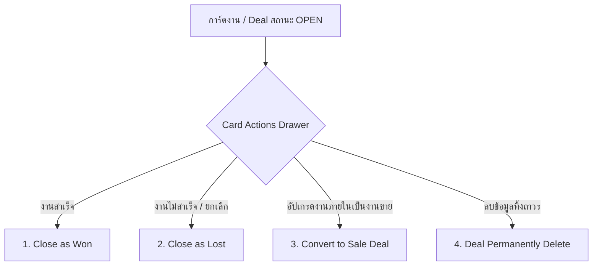
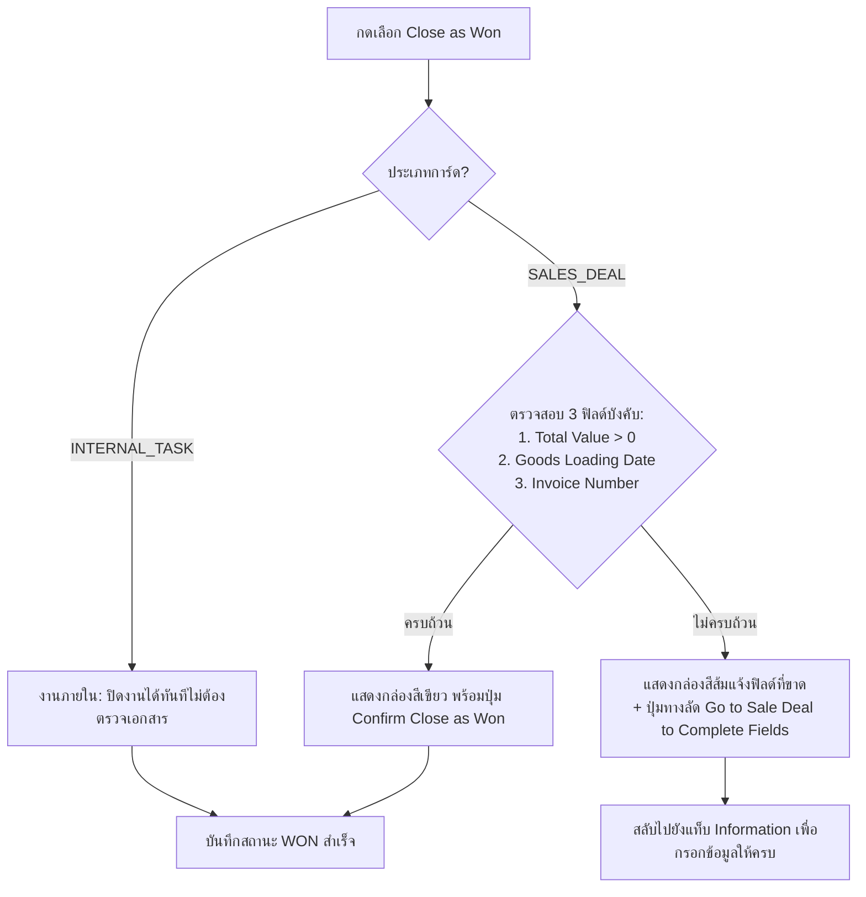
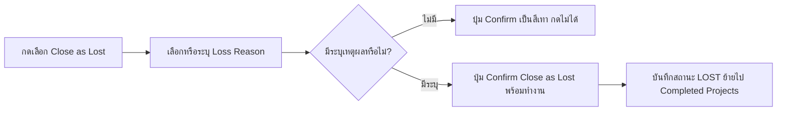
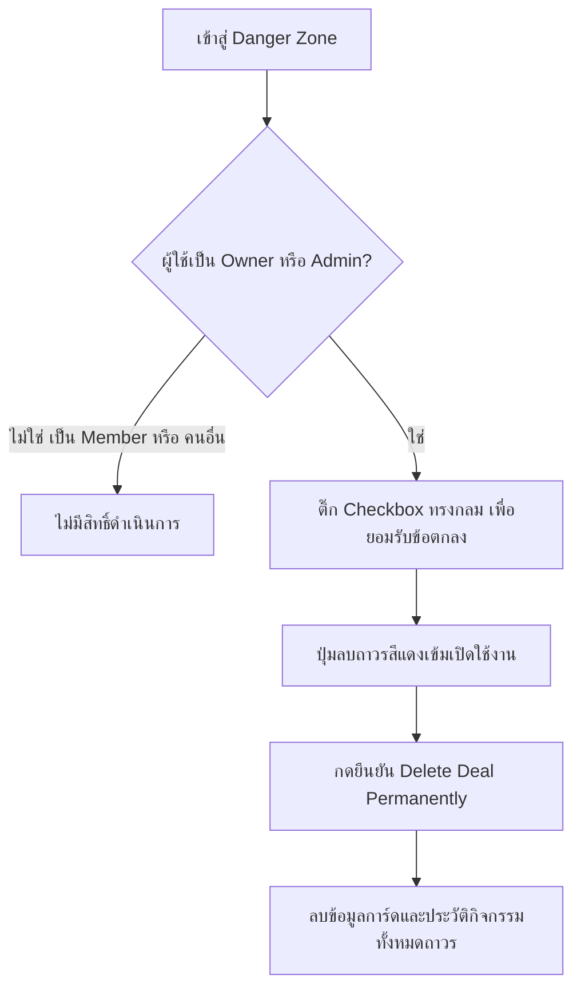

# 05. วงจรชีวิตการ์ดและการปิดดีล (Deal Actions & Lifecycle)

> **กลุ่มเป้าหมายผู้อ่าน**: พนักงานขาย, ผู้จัดการ (Manager), ผู้ดูแลระบบ (Admin) และ AI Agent  
> **วัตถุประสงค์**: อธิบายเงื่อนไขทางธุรกิจ (Business Rules), สิทธิ์การเข้าถึง (Permission Matrix), โฟลว์การทำงาน (Workflows) และการใช้งาน Card Actions Drawer ทั้ง 4 ฟังก์ชันหลัก: Close as Won, Close as Lost, Convert to Sale Deal และ Deal Permanently Delete

---

## 1. ภาพรวม Card Actions Drawer

หน้าต่าง **Card Actions Drawer** (หรือเมนู "การกระทำกับการ์ด") เป็นศูนย์กลางในการเปลี่ยนสถานะสำคัญของดีล โดยสามารถเปิดได้จากปุ่ม **Card Actions** ด้านบนขวาของการ์ด หรือเปิดผ่านเมนู Hamburger ในหน้าแก้ไขการ์ด



---

## 2. ตารางสรุปสิทธิ์การมองเห็นและการใช้งาน (Permissions Matrix)

| ฟังก์ชันการทำงาน | Card Type ที่รองรับ | สิทธิ์ผู้ใช้งานที่ทำได้ | สิทธิ์เมนูระดับแผนกที่ต้องมี | ผลลัพธ์ในระบบ |
| :--- | :---: | :---: | :---: | :--- |
| **Close as Won** | `SALES_DEAL` & `INTERNAL_TASK` | Owner, Manager of Owner, Admin | ไม่จำกัด | สถานะเปลี่ยนเป็น `WON` และย้ายเข้าคลัง Completed Projects |
| **Close as Lost** | `SALES_DEAL` & `INTERNAL_TASK` | Owner, Manager of Owner, Admin | ไม่จำกัด | สถานะเปลี่ยนเป็น `LOST` และย้ายเข้าคลัง Completed Projects |
| **Convert to Sale Deal** | เฉพาะ `INTERNAL_TASK` (ที่ยัง `OPEN`) | Owner, Manager of Owner, Admin | แผนกต้องมีสิทธิ์ `pipeline.information` (Sale Deal) หรือเป็น Admin | ประเภทเปลี่ยนเป็น `SALES_DEAL` ถาวร (ไม่สามารถแปลงกลับได้) |
| **Deal Permanently Delete** | ทุกประเภท และทุกสถานะ | เฉพาะ **Owner** หรือ **Admin** เท่านั้น | ไม่จำกัด | ลบข้อมูลการ์ดและประวัติทั้งหมดออกจากฐานข้อมูลถาวร |

> [!IMPORTANT]
> **Team Member (สมาชิกที่ถูกเชิญมาร่วมงาน)**:
> สมาชิกที่ถูกเชิญมาร่วมในการ์ด **ไม่มีสิทธิ์** กด Convert to Sale Deal, ปิดดีล (Won/Lost) แทนเจ้าของ หรือลบการ์ดถาวร เพื่อป้องกันข้อผิดพลาดทางธุรกรรม

---

## 3. ฟังก์ชันที่ 1: Close as Won (งานสำเร็จ)

การปิดงานว่าประสบความสำเร็จ (Won) ระบบจะแยกตรรกะการตรวจสอบตามประเภทของการ์ด (`type`):



### A. กรณีการ์ดเป็น `INTERNAL_TASK` (งานภายใน)
- ไม่จำเป็นต้องมีข้อมูลยอดขายหรือการขนส่ง
- ผู้ใช้สามารถกดปุ่มยืนยันปิดงานได้ทันทีในคลิกเดียว

### B. กรณีการ์ดเป็น `SALES_DEAL` (งานขาย)
- **เงื่อนไขบังคับ 3 ข้อ (Mandatory Fields)**:
  1. `Total Value` (มูลค่าดีลต้องมากกว่า 0 และระบุสกุลเงิน)
  2. `Goods Loading Date` (วันโหลดสินค้าขึ้นตู้/จัดส่ง)
  3. `Invoice Number` (เลขที่ใบแจ้งหนี้)
- **พฤติกรรมของหน้าต่าง (UI Behavior)**:
  - **หากข้อมูลยังไม่ครบ**: ระบบจะไม่เปิดให้กดปุ่มปิดงาน แต่จะแสดงกล่องเตือนสีส้มระบุชื่อฟิลด์ที่ยังขาด พร้อมปุ่มกด **"Go to Sale Deal to Complete Fields"** ซึ่งเมื่อคลิกจะปิด Drawer และนำผู้ใช้ไปยังแท็บกรอกข้อมูล `Sale Deal` ทันที
  - **หากข้อมูลครบแล้ว**: ระบบจะแสดงกล่องสถานะสีเขียว *"All required sales deal fields are completed"* พร้อมปุ่มสีเขียวมะนาว (Lime) **"Confirm Close as Won"** ให้กดยืนยัน

---

## 4. ฟังก์ชันที่ 2: Close as Lost (งานไม่สำเร็จ / ขอยกเลิก)

ใช้ในกรณีที่ดีลไม่เกิดขึ้น ลูกค้ายกเลิกคำสั่งซื้อ หรือโครงการภายในถูกระงับ



### เงื่อนไขและกฎทางธุรกิจ:
1. **บังคับระบุเหตุผล (Mandatory Loss Reason)**: ผู้ใช้งานจำเป็นต้องเลือกหรือกรอกเหตุผลที่ทำให้ปิดดีลไม่สำเร็จ เพื่อประโยชน์ในการนำข้อมูลไปวิเคราะห์ทางสถิติและปรับปรุงกระบวนการขาย
2. **การย้ายสถานะ**: เมื่อปิดเป็น Lost การ์ดจะถูกย้ายออกจาก Active Pipeline ทันที เพื่อไม่ให้รบกวนพื้นที่การทำงาน และจะถูกจัดเก็บไว้ในหน้า **Completed Projects** เพื่อให้สามารถค้นหาประวัติย้อนหลังได้

---

## 5. ฟังก์ชันที่ 3: Convert to Sale Deal (แปลงงานเป็นงานขาย)

ฟังก์ชันนี้มีไว้สำหรับยกระดับการ์ดงานประเภท `INTERNAL_TASK` (งานภายในทั่วไป) ให้กลายเป็นการ์ดงานขาย `SALES_DEAL` เต็มรูปแบบ เมื่อค้นพบว่างานดังกล่าวมีโอกาสทางธุรกิจหรือมีการซื้อขายเกิดขึ้นจริง

```mermaid
flowchart TD
    TaskCard[การ์ด Internal Task] --> CheckConditions{ตรวจสอบเงื่อนไข:<br/>1. สถานะยังคง OPEN?<br/>2. เป็น Owner/Manager/Admin?<br/>3. แผนกมีสิทธิ์ใช้ Sale Deal?}
    
    CheckConditions -->|ไม่ผ่านเงื่อนไข| HideBtn[ซ่อนปุ่ม หรือไม่อนุญาตให้กด]
    CheckConditions -->|ผ่านทุกเงื่อนไข| ShowBtn[แสดงปุ่ม Convert to Sale Deal]
    
    ShowBtn --> ClickConvert[ผู้ใช้คลิกยืนยันการแปลง]
    ClickConvert --> MakeSaleDeal[ระบบแปลงประเภทเป็น SALES_DEAL ทันที<br/>* เป็นการเปลี่ยนแปลงถาวร (Irreversible)]
```

### สิทธิ์ในการมองเห็นและใช้งานปุ่ม Convert:
1. **สถานะการ์ด**: การ์ดต้องมีสถานะเป็น `OPEN` เท่านั้น (การ์ดที่ Won หรือ Lost แล้วจะไม่สามารถแปลงได้)
2. **ประเภทเดิม**: ต้องเป็นการ์ด `INTERNAL_TASK` เท่านั้น
3. **สิทธิ์ระดับแผนก**: แผนกที่ผู้ใช้สังกัดจะต้องได้รับสิทธิ์เปิดใช้งานฟีเจอร์ `pipeline.information` (Sale Deal) หรือผู้ใช้ต้องมี Role เป็น `ADMIN`
4. **สิทธิ์ความสัมพันธ์**: ต้องเป็นเจ้าของการ์ด (`isOwner`), ผู้จัดการของผู้รับผิดชอบ (`isManagerOfOwner`), หรือผู้ดูแลระบบ (`isAdmin`)

> [!WARNING]
> **การดำเนินการนี้ไม่สามารถย้อนกลับได้ (Irreversible Action)**:  
> เมื่อการ์ดถูกแปลงเป็น `SALES_DEAL` แล้ว จะไม่สามารถแปลงกลับเป็น `INTERNAL_TASK` ได้อีก เนื่องจากการ์ดงานขายจะมีโครงสร้างฟิลด์และข้อกำหนดทางบัญชีที่เข้มงวดกว่า

---

## 6. ฟังก์ชันที่ 4: Deal Permanently Delete (การลบการ์ดถาวร)

ตั้งอยู่ในส่วนล่างสุดของ Card Actions Drawer ภายใต้หัวข้อ **Danger Zone** สำหรับกรณีที่สร้างการ์ดผิดพลาด หรือต้องการล้างข้อมูลที่ไม่ต้องการออกจากระบบอย่างแท้จริง



### รายละเอียดและกลไกความปลอดภัย:
1. **ผู้มีสิทธิ์ลบ**:
   - เฉพาะ **เจ้าของการ์ด (Owner)** หรือ **ผู้ดูแลระบบสูงสุด (Admin)** เท่านั้น
   - ผู้ใช้ระดับ Manager (ที่ไม่ได้เป็น Owner) และ Team Member **ไม่สามารถลบการ์ดได้**
2. **ระบบกล่องยืนยันแบบวงกลม (Circular Checkbox)**:
   - ผู้ใช้ต้องคลิกเลือกกล่องข้อความยืนยันความเสี่ยง ซึ่งถูกออกแบบเป็นวงกลม (`rounded-full`) พร้อมเครื่องหมายติ๊กถูกสีขาว เพื่อป้องกันอุบัติเหตุจากการเผลอกด
   - ปุ่มสีแดง **"Delete Deal Permanently"** จะเปิดให้กดได้ก็ต่อเมื่อติ๊กถูกในช่องยืนยันแล้วเท่านั้น
3. **ผลกระทบของข้อมูล (Data Cascade Wipe)**:
   - เมื่อยืนยันการลบ ข้อมูลทั้งหมดของการ์ดจะถูกลบออกจากฐานข้อมูลทันที ได้แก่:
     - ข้อมูลตัวการ์ด (Opportunity)
     - บันทึกกิจกรรมทั้งหมด (Activity Logs)
     - โน้ตข้อความ (Internal Notes)
     - คำถามด่วนของผู้จัดการ (Accelerator Questions)
     - รายการไฟล์แนบ (Attachments)
   - ข้อมูลนี้**ไม่สามารถกู้คืนได้**อีก

---

## 7. คำแนะนำสำหรับ AI Agent ในการจัดการ Deal Actions

เมื่อได้รับคำสั่งจากผู้ใช้งานเกี่ยวกับการดำเนินการกับการ์ด:
1. **กรณีผู้ใช้ถามว่าทำไมปิด Won ไม่ได้**:
   - ให้ตรวจสอบประเภทการ์ดว่าคือ `SALES_DEAL` หรือไม่
   - หากใช่ ให้ตรวจสอบว่าขาดฟิลด์ใดใน 3 ฟิลด์ (`Total Value`, `Goods Loading Date`, `Invoice Number`) และแจ้งผู้ใช้ให้เข้าไปกรอกในแท็บ Sale Deal
2. **กรณีผู้ใช้ถามเรื่องปุ่ม Convert to Sale Deal**:
   - ตรวจสอบสิทธิ์ว่าผู้ใช้เป็น Team Member หรือไม่ (ถ้าเป็น Member จะมองไม่เห็นปุ่ม ต้องให้ Owner ดำเนินการ)
   - ตรวจสอบว่าแผนกของผู้ใช้ได้รับสิทธิ์เปิดใช้ Sale Deal ใน Matrix หรือไม่
3. **กรณีผู้ใช้ขอให้ลบดีล**:
   - แจ้งเตือนเรื่องความเสี่ยงของการลบถาวร และตรวจสอบว่าผู้ใช้เป็น Owner หรือ Admin เท่านั้น
