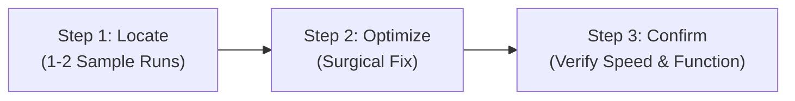
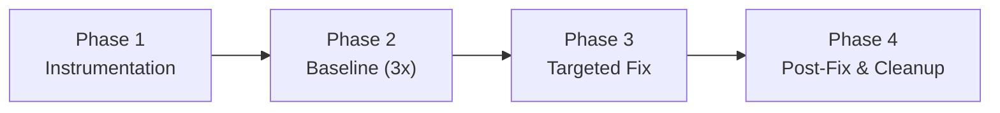

# Trace Performance Bottleneck

Diagnose and resolve performance bottlenecks across the stack (Browser UI, Server Actions, Neon DB, APIs) without guesswork and without unnecessary ceremony.

---

> [!CRITICAL]
> ## 🛑 MANDATORY STEP 0: MUST ASK USER TO CONFIRM MODE BEFORE DOING ANYTHING
>
> Whenever this skill is activated (e.g. user mentions "trace performance", "ช้า", "โหลดนาน", "จูนความเร็ว", "bottleneck", or calls `$trace-performance-bottleneck`):
>
> **YOU MUST NOT PROCEED TO READ CODE, PROFILE, OR RUN ANY COMMANDS.**
>
> You **MUST STOP IMMEDIATELY** and ask the user to confirm which mode to use (preferably via the `ask_question` tool or a clear prompt):
>
> 1. **⚡ Fast Mode (Recommended / แนะนำ)**:
>    - Quick 3-step diagnostic: **Locate ➔ Optimize ➔ Confirm**
>    - Focuses directly on low-hanging fruits and proven bottlenecks (over-fetching, caching, indexes).
>    - No multi-round production builds, no fake stubs, no statistical loops.
>    - **Estimated time: ~2–3 minutes (3–4 turns).**
>
> 2. **🔬 Deep Mode (โหมดละเอียด)**:
>    - Multi-layer telemetry probes (`[PERF-TRACE]`), baseline measurement, and verified post-fix benchmark.
>    - Reserved for elusive bugs, sporadic latency spikes (Heisenbugs), or formal performance audit reports.
>    - **Estimated time: ~10–15 minutes.**
>
> **HARD RULE**: If the user has not selected or confirmed a mode, **DO NOT START ANY WORK**. Wait for the user's response.

---

## ⚡ Mode 1: Fast Mode (Lean 3-Step — Default for 90% of tasks)

Fast Mode gets straight to the point: diagnose the actual layer, fix it surgically, and verify.

### Step 1: Locate Bottleneck (ชี้เป้า — 1–2 runs max)
- Do not guess or do random refactoring. Inspect the slow action directly:
  - Check browser Network tab / Server Action duration / Prisma query logs for 1–2 requests.
  - Identify the primary bottleneck layer:
    - **Client Render**: Unnecessary re-render loops, blocking layout recalculations, or heavy mount effects.
    - **Payload / Over-fetching**: Serializing huge unused JSON relations or leaking data via SSR props.
    - **Server Action / Auth**: Repeated database session lookups (`user.findFirst`) on every action.
    - **Database / Prisma**: Unindexed queries, N+1 loops, or sequential heavy `groupBy` / `findMany`.

### Step 2: Optimize (ผ่าตัดแก้ตรงจุด)
- Implement the targeted fix directly without intermediate stubs or fake mocks:
  - **Pruning**: Replace `include` with `select`; prune fields/relations not displayed on the target view.
  - **Auth Caching**: Use an in-memory TTL cache for user/actor lookups within the session lifecycle.
  - **Query Deferral**: Defer non-critical heavy logs or audit trails to modal/drawer views (`includeLogs: false`).
  - **Index**: Add database index (`@@index`) in `schema.prisma` if filtering/sorting on unindexed fields.
  - **Optimistic UI**: Provide instant visual feedback before background server completion where appropriate.

### Step 3: Confirm (ยืนยันผล & สิทธิ์)
- Test the action once or twice to confirm:
  1. Latency is visibly faster.
  2. Department permissions and contact masking remain intact.
  3. No TypeScript errors (`npx tsc --noEmit`) and no runtime regressions.
- Deliver a concise summary to the user (what was slow, what was changed, and the verified result).

---

## 🔬 Mode 2: Deep Mode (Streamlined Comprehensive — 10% of tasks)

Used only when the bottleneck is elusive, sporadic, or when formal statistical benchmarking is required.

1. **Phase 1: Instrumentation**: Inject non-blocking monotonic `[PERF-TRACE]` probes across Browser, Server, and DB boundaries.
2. **Phase 2: Baseline Benchmark**: Run 3 consecutive measurements on local production build to establish baseline p50/p95.
3. **Phase 3: Targeted Fix**: Implement the surgical fix directly (NO wasteful fake stubbing).
4. **Phase 4: Post-Fix & Cleanup**: Measure 3 post-fix runs, verify delta, **clean up all `[PERF-TRACE]` probes**, and generate the before/after report.

---

## Core Guidelines & Safety Rules

1. **Always Preserve Security & Permissions**:
   - Never bypass department menu permissions, RBAC checks, or contact masking rules for the sake of speed.
2. **Lean Querying**:
   - Prefer `select` over `include` for relational data.
3. **Clean Codebase**:
   - In Deep Mode, every temporary `[PERF-TRACE]` probe MUST be completely removed before completing the task.
