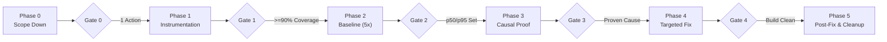

# Trace Performance Bottleneck (Chained Workflow)

Find the real end-to-end bottleneck of a slow web action by reproducing it, correlating browser, Server Action, Prisma/Neon, and external-service timings, fixing the measured cause, and benchmarking before/after.

> [!IMPORTANT]
> **STRICT CHAIN ENFORCEMENT**: You MUST NOT improvise or jump between phases. You MUST inspect the session state, read ONLY the current active phase file, and satisfy its programmatic Exit Gate before moving forward.

---

## The 6-Phase Chained Progression



1. **[Phase 0: Scope Down](phases/phase-0-scope.md)** ➔ Survey actions, narrow down to **exactly 1 primary load-bearing action**, and define an observable completion signal.
2. **[Phase 1: Instrumentation](phases/phase-1-instrumentation.md)** ➔ Inject monotonic probes tagged `[PERF-TRACE]` across Browser, Server, Neon DB, and Pusher using a single `traceId`.
3. **[Phase 2: Baseline Benchmark](phases/phase-2-baseline.md)** ➔ Run local production build, warm up, and capture at least 5 measured runs (p50/p95, requests, transfer bytes).
4. **[Phase 3: Causal Proof](phases/phase-3-causality.md)** ➔ Perform controlled experiments to scientifically prove the bottleneck is causal, not merely correlated.
5. **[Phase 4: Targeted Fix](phases/phase-4-optimization.md)** ➔ Implement surgical optimization for the proven cause while preserving security, authorization, and rollback.
6. **[Phase 5: Verification & Cleanup](phases/phase-5-verification.md)** ➔ Re-benchmark under identical conditions, verify delta, remove all `[PERF-TRACE]` probes, and produce the final report.

---

## State Machine & Checkpoint Controller

The session state is tracked in `.perf-trace/session.json`. Use the universal CLI tool to inspect and advance phases:

### Common Commands:

- **Check Current Phase & Gates:**
  ```bash
  node .agents/skills/trace-performance-bottleneck/scripts/perf-chain.mjs status
  ```

- **Initialize Session (Phase 0 ➔ Phase 1):**
  ```bash
  node .agents/skills/trace-performance-bottleneck/scripts/perf-chain.mjs init <url> <actionId> <actionName> "<completionSignal>"
  ```

- **Record Baseline Runs (Phase 2):**
  ```bash
  node .agents/skills/trace-performance-bottleneck/scripts/perf-chain.mjs record baseline --runs 120,115,118,122,119 --bytes 45200 --requests 8
  ```

- **Pass Exit Gate and Unlock Next Phase:**
  ```bash
  node .agents/skills/trace-performance-bottleneck/scripts/perf-chain.mjs pass-gate <phaseNumber> "<EvidenceSummary>"
  ```

- **Record Post-Fix Runs (Phase 5):**
  ```bash
  node .agents/skills/trace-performance-bottleneck/scripts/perf-chain.mjs record postfix --runs 35,32,34,36,33 --bytes 12100 --requests 2
  ```

---

## Strict Operating Rules

1. **Step-by-Step Isolation:**
   - Always run `perf-chain.mjs status` first.
   - Read **ONLY** the instructions for the active phase (`phases/phase-<currentPhase>-*.md`).
2. **Never Optimize in Phase 0–3:**
   - Modifying production code to optimize performance before Phase 4 is a critical violation.
3. **80/20 Scope Rule:**
   - If an inventory yields 50+ actions, Phase 0 **MUST** select only the single highest-impact action. Never attempt to optimize an entire page in one unmeasured pass.
4. **Local Production Build Only:**
   - Benchmarks in Phase 2 and Phase 5 must run on `next build && next start` (or `npm run build && npm run start`). Never report numbers from `next dev`.
5. **Trace Coverage Requirement:**
   - If accounted sub-spans make up $<90\%$ of total wall time, report `INCOMPLETE TRACE` and instrument the missing span before forming a hypothesis.
6. **Mandatory Cleanup:**
   - Every `[PERF-TRACE]` probe MUST be completely removed in Phase 5 before calling the task complete.

---

## Supporting References

- Monotonic probe patterns: [references/instrumentation.md](references/instrumentation.md)
- Pipeline case study & prior solutions: [references/pipeline-case-study.md](references/pipeline-case-study.md)
- Problem registry: [problem-cases/](problem-cases/README.md)
- Report format: [references/report-format.md](references/report-format.md)
- Trace visualization script:
  ```bash
  node .agents/skills/trace-performance-bottleneck/scripts/render-trace.mjs trace.json
  ```
