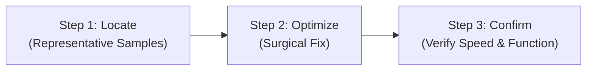
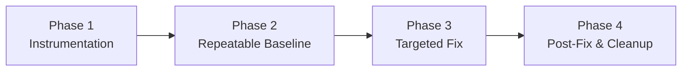

# Trace Performance Bottleneck

Diagnose and resolve performance bottlenecks across the stack (Browser UI, Server Actions, Neon DB, APIs) when ordinary performance measurement cannot localize the cause.

Use the general `performance` skill as the entry point for ordinary slow-page requests. For CRM changes, `crm-feature-architecture` and relevant domain skills take precedence over optimization patterns in this skill.

---

> [!IMPORTANT]
> ## Choose the smallest sufficient mode
>
> Proceed without a mode question when the request and evidence clearly fit Fast Mode. Ask the user to choose only when Deep Mode would add material instrumentation, production-like benchmarking, or time that they did not request.
>
> 1. **⚡ Fast Mode (Recommended / แนะนำ)**:
>    - Quick 3-step diagnostic: **Locate ➔ Optimize ➔ Confirm**
>    - Focuses directly on low-hanging fruits and proven bottlenecks (over-fetching, caching, indexes).
>    - No multi-round production builds, no fake stubs, no statistical loops.
>    - **Estimated time: ~2–3 minutes (3–4 turns).**
>
> 2. **🔬 Deep Mode (โหมดละเอียด)**:
>    - Multi-layer telemetry probes (`[PERF-TRACE]`), baseline measurement, and verified post-fix benchmark.
>    - Reserved for elusive bugs, sporadic latency spikes (Heisenbugs), or formal performance audit reports.
>    - **Estimated time: ~10–15 minutes.**
>
> Use Deep Mode for intermittent or cross-layer latency, an unresolved Fast Mode investigation, or an explicitly requested formal benchmark.

---

## ⚡ Mode 1: Fast Mode (Lean 3-Step — Default for 90% of tasks)

Fast Mode gets straight to the point: diagnose the actual layer, fix it surgically, and verify.

```mermaid
graph LR
    S1["Step 1: Locate<br/>(Representative Samples)"] --> S2["Step 2: Optimize<br/>(Surgical Fix)"]
    S2 --> S3["Step 3: Confirm<br/>(Verify Speed & Function)"]
```

### Step 1: Locate Bottleneck (ชี้เป้า)
- Do not guess or do random refactoring. Inspect the slow action directly:
  - Check browser Network tab / Server Action duration / Prisma query logs with enough representative requests to identify the dominant layer.
  - Identify the primary bottleneck layer:
    - **Client Render**: Unnecessary re-render loops, blocking layout recalculations, or heavy mount effects.
    - **Payload / Over-fetching**: Serializing huge unused JSON relations or leaking data via SSR props.
    - **Server Action / Auth**: Repeated database session lookups (`user.findFirst`) on every action.
    - **Database / Prisma**: Unindexed queries, N+1 loops, or sequential heavy `groupBy` / `findMany`.

### Step 2: Optimize (ผ่าตัดแก้ตรงจุด)
- Implement the targeted fix directly without intermediate stubs or fake mocks:
  - **Pruning**: Replace `include` with `select`; prune fields/relations not displayed on the target view.
  - **Auth work**: Reduce proven duplicate lookups without weakening authorization freshness. Treat cross-request auth caching as a security-sensitive architecture decision, not a default fix.
  - **Query Deferral**: Defer non-critical heavy logs or audit trails to modal/drawer views (`includeLogs: false`).
  - **Index**: Add a database index only from query-plan or timing evidence and use the repository's normal migration workflow.
  - **Optimistic UI**: Provide instant visual feedback before background server completion where appropriate.

### Step 3: Confirm (ยืนยันผล & สิทธิ์)
- Test the action once or twice to confirm:
  1. Latency is visibly faster.
  2. Department permissions and contact masking remain intact.
  3. No TypeScript errors (`npx tsc --noEmit`) and no runtime regressions.
- Deliver a concise summary to the user (what was slow, what was changed, and the verified result).

---

## 🔬 Mode 2: Deep Mode (Streamlined Comprehensive — 10% of tasks)

Used only when the bottleneck is elusive, sporadic, or when formal statistical benchmarking is required.

```mermaid
graph LR
    P1["Phase 1<br/>Instrumentation"] --> P2["Phase 2<br/>Repeatable Baseline"]
    P2 --> P3["Phase 3<br/>Targeted Fix"]
    P3 --> P4["Phase 4<br/>Post-Fix & Cleanup"]
```

1. **Phase 1: Instrumentation**: Inject correlated monotonic `[PERF-TRACE]` probes only at boundaries needed to distinguish the competing hypotheses.
2. **Phase 2: Baseline Benchmark**: Use enough equivalent measurements for the observed variance; record environment and cold/warm state. Do not label three samples as reliable p95 evidence.
3. **Phase 3: Targeted Fix**: Implement the surgical fix directly (NO wasteful fake stubbing).
4. **Phase 4: Post-Fix & Cleanup**: Repeat the equivalent measurement set, verify the delta, **clean up all `[PERF-TRACE]` probes**, and generate the before/after report.

The files under `phases/` and `references/` are legacy deep-trace material. Read them only when their procedure fits the current investigation; this entrypoint controls when they conflict. Do not use fixed sample counts or mock/stub steps when they would change the code path being measured.

---

## Core Guidelines & Safety Rules

1. **Always Preserve Security & Permissions**:
   - Never bypass department menu permissions, RBAC checks, or contact masking rules for the sake of speed.
2. **Lean Querying**:
   - Prefer `select` over `include` for relational data.
   - Do not move SSR data to CSR solely to reduce HTML size; compare total workflow transfer and first usable content.
3. **Clean Codebase**:
   - In Deep Mode, every temporary `[PERF-TRACE]` probe MUST be completely removed before completing the task.
4. **Reliable outcomes**:
   - Do not make critical audit or business side effects fire-and-forget for speed.
   - Optimistic UI must expose failure and reconcile authoritative state.
